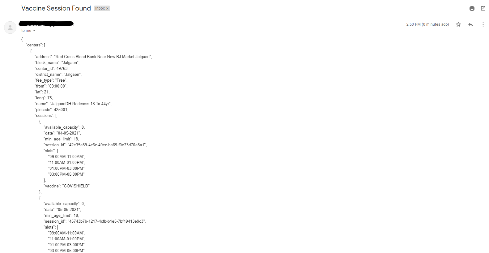

# VaccineSessionNotifier
A Python Wrapper created on COWIN public APIs to check vaccine session availability

### Description

VaccineSessionNotifier checks the cowin API's endpoints periodically to find vaccination slots available for your pin code.
If vaccine session is found, it will send you email with details until the slots are available.

### Steps to run the script

#### Step 1) 
Enable application access on your gmail with steps given here;
https://support.google.com/accounts/answer/185833?p=InvalidSecondFactor&visit_id=637554658548216477-2576856839&rd=1

This will generate a password which needs to be added in userInput.py file to send email.

#### Step 2) 
Enter the details described as below in the file userInput.py present in the same folder.
* PINCODE  : Pincode of your local residence
* EMAIL ID : Your email address (GMAIL)
* PASSWORD : Password generated from step 1
* SLEEPER  : Script will sleep for given time (in seconds) before looking for another available session.

#### Step 3) 
On your terminal run: python cowinVaccineNotifier.py

### Sample Email Output 

**COWIN APIs Reference**

Information regarding APIs can be found at https://apisetu.gov.in/public/marketplace/api/cowin/cowin-public-v2